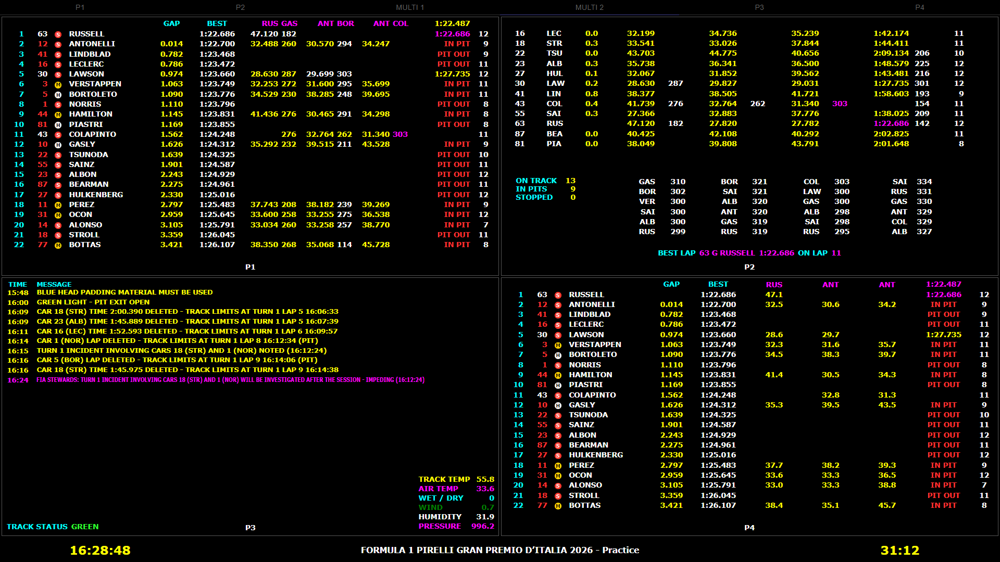

# Retro LiveTiming – MultiView Edition

Customized **Retro LiveTiming** build focused on the **MULTI 1 / MULTI 2**
timing layouts.

**Current release: v1.0.0**

This project is an unofficial community modification of Retro LiveTiming by
TrueVirusTV. The embedded upstream package metadata declares the original
project as MIT licensed.

> Not affiliated with or endorsed by Formula 1, F1 TV, MultiViewer, or their
> respective owners.

> **Note:** The Qualifying layout is still a work in progress and is not yet part of the finished v1.0 MultiView design. Practice and Race are the currently optimized session layouts.

## Highlights

### MULTI 1 / MULTI 2
- Refined 2×2 MultiView layouts.
- Compact P1, P2, P3 and P4 presentation.
- Numerous alignment, spacing and readability improvements.

### P1
- Refined timing-column alignment.
- Improved BEST lap presentation.
- Simplified compact headers in Practice and Race.
- Unneeded headings such as POS, CAR, DRIVER and T are hidden in the Multi layouts.

### P2
- ON TRACK / IN PITS / STOPPED counters.
- Six-row speed ranking area.
- Refined BEST LAP / ON LAP presentation.
- Improved gap-to-car-ahead alignment.
- Refined lap-count positioning.

### P3
- Race-control messages are displayed chronologically.
- The newest message appears at the bottom.

### P4 – Practice
- Removed Speed 1 / Speed 2 / Speed 3 columns.
- Compact sector values with one decimal place.
- Rotating theoretical sector-best / driver-abbreviation headers.
- Theoretical best lap shown in magenta.
- GAP centered.
- Last-lap values aligned under the theoretical best-lap column.
- Simplified compact headers.

### P4 – Race
- Car number positioned cleanly between position and driver.
- Compact race header.
- Pit-count values remain visible while the P heading is hidden.

### Footer
- Countdown timing corrected.
- Track-status bar sizing and vertical positioning refined.

## Screenshots

### Multi 1 – Practice

### Multi 1 – Race

### Multi 2 – Practice

### Multi 2 – Race

## Installation

This release is provided as a complete portable Windows package.

1. Download `RetroLiveTiming-MultiView-v1.0.0-Windows.zip`.
2. Extract the ZIP to a folder of your choice.
3. Start `RetroLiveTiming for F1.exe`.

No manual `app.asar` replacement is required.

## Requirements

- Windows 10 or Windows 11.
- MultiViewer / live timing must be running and accessible to Retro LiveTiming.
- No previous Retro LiveTiming installation is required for the portable ZIP.

## Versioning

The public MultiView Edition starts at **v1.0.0**.

The executable itself may still show metadata from the original upstream
application because this release replaces `resources/app.asar` rather than
rebuilding the complete Windows `.exe`.

## Attribution / License

Original application author in the embedded package metadata: **TrueVirusTV**.

The upstream package metadata declares the license as **MIT**. Preserve the
original copyright and license notices when redistributing source or derivative
builds.

## Disclaimer

Formula 1, F1, F1 TV and related marks are trademarks of their respective
owners. This is an unofficial fan/community project.
