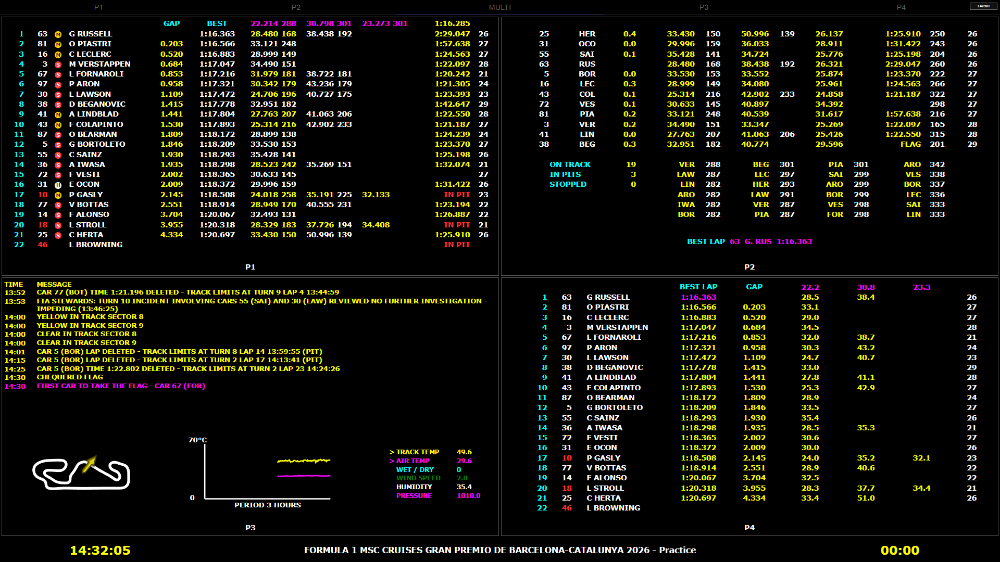
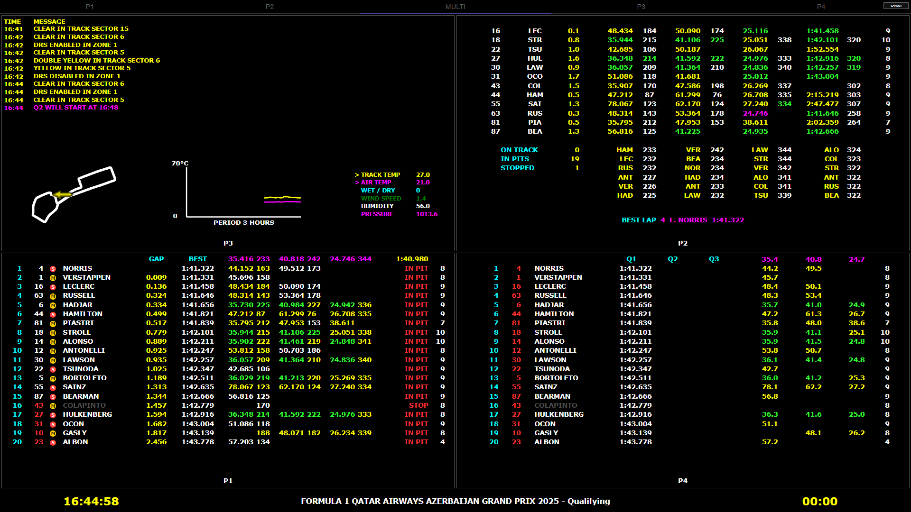
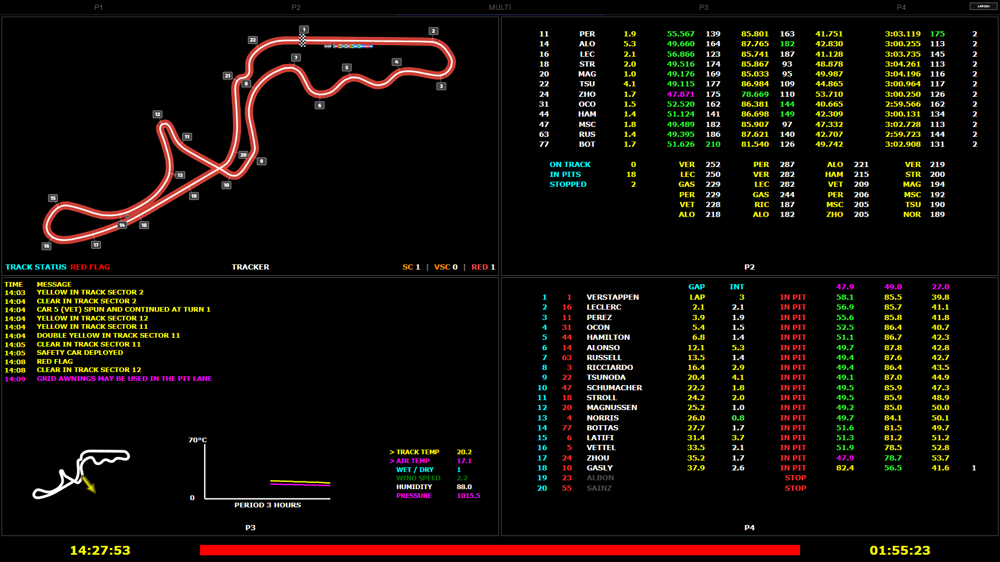
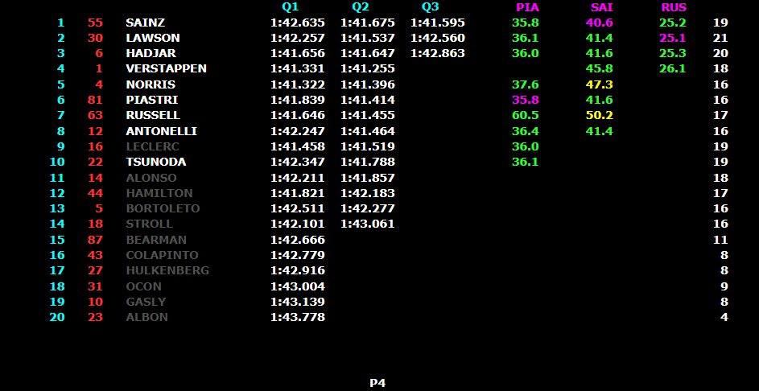

# Retro LiveTiming – MultiView Edition

Customized **Retro LiveTiming** build focused on a compact and flexible **2×2 MULTI timing layout**.

This project is an unofficial community modification of Retro LiveTiming by **TrueVirusTV**. The embedded upstream package metadata declares the original project as MIT licensed.

> Not affiliated with or endorsed by Formula 1, F1 TV, MultiViewer, or their respective owners.

## Highlights

### MULTI

- Refined 2×2 timing layout for Practice, Qualifying and Race sessions.
- Compact P1, P2, P3 and P4 presentation.
- Each of the four screen positions can be configured while Retro LiveTiming is running.
- P1, P2, P3, P4 or the Race Control Tracker can be assigned to any window.
- Improved spacing, alignment and readability throughout the MultiView layout.
- Integrated weather, circuit-map and race-control information.
- Improved compatibility with 2026 F1 timing data, including safer driver-name handling when individual name fields are missing.

## MULTI - SCREEN LAYOUT

The **MULTI - SCREEN LAYOUT** menu allows you to configure all four windows of the 2×2 MultiView without restarting Retro LiveTiming.

The four screen positions are:

- **TOP LEFT**
- **TOP RIGHT**
- **BOTTOM LEFT**
- **BOTTOM RIGHT**

For each position you can select one of five views:

| Button | View |
| --- | --- |
| **P1** | Main timing screen |
| **P2** | Extended timing / speed and status information |
| **P3** | Race Control, circuit map and weather |
| **P4** | Compact session overview |
| **T** | Race Control Tracker |

The currently selected view for each position is highlighted in cyan.

### Changing the layout

1. Open **MULTI - SCREEN LAYOUT**.
2. Find the screen position you want to change.
3. Select **P1**, **P2**, **P3**, **P4** or **T**.
4. If the selected view is already assigned to another window, the affected views are automatically swapped.
5. Repeat this for any other window you want to change.

Press **DEFAULT** at any time to restore the standard arrangement:

| Position | Default view |
| --- | --- |
| TOP LEFT | P1 |
| TOP RIGHT | P2 |
| BOTTOM LEFT | P3 |
| BOTTOM RIGHT | P4 |

This makes it possible to build a layout for the current session or your personal preference without changing the underlying Retro LiveTiming installation.

## Views

### P1

- Refined timing-column alignment.
- Improved BEST lap presentation.
- Compact headers for Practice and Race.
- Unneeded headings are hidden in the MULTI layout to maximize usable space.
- Improved driver-name compatibility with newer timing feeds.

### P2

- ON TRACK / IN PITS / STOPPED counters.
- Six-row speed ranking area.
- Refined BEST LAP / ON LAP presentation.
- Improved gap-to-car-ahead alignment.
- Refined lap-count positioning.
- Improved replay rewind handling.
- Cached lap-dependent values are reset when seeking backwards, preventing data from later laps from appearing at an earlier replay position.

### P3

- Race-control messages displayed chronologically.
- Newest message appears at the bottom.
- Integrated circuit map using MultiViewer circuit geometry.
- Custom wind-direction arrow aligned to the displayed circuit orientation.
- 3-hour track-temperature and air-temperature graph.
- Compact weather block with:
  - Track temperature
  - Air temperature
  - Wet / dry status
  - Wind speed
  - Humidity
  - Pressure
- Refined lower-layout sizing, spacing and footer clearance.

> **Track map note:** Circuit geometry used by the integrated P3 map is sourced from **MultiViewer** data. This project is not affiliated with or endorsed by MultiViewer.

### P4 – Practice

- Compact Practice overview.
- Sector values displayed with one decimal place.
- Rotating theoretical sector-best / driver-abbreviation information.
- Theoretical best lap shown in magenta.
- GAP centered for improved readability.
- Simplified compact headers.

### P4 – Qualifying

- Refined Qualifying overview.
- Improved timing-column spacing and readability.
- GAP plus Q1 / Q2 / Q3 session times.
- Improved driver-status and elimination presentation.
- Refined theoretical sector information.

### P4 – Race

- Car number positioned cleanly between position and driver.
- Compact race header.
- Pit-count values remain visible while unnecessary headings are hidden.

### Race Control Tracker

- Available directly from the Screen Layout menu using **T**.
- Tracks Safety Car, Virtual Safety Car and Red Flag phases.
- Displays cumulative **SC / VSC / RED** counters.
- Counter history remains visible after a phase has ended.
- Improved compatibility with older F1 replay timing data.
- Red Flag filtering also supported for Formula 2 timing where available.

### Footer

- Corrected countdown timing.
- Refined track-status bar sizing and vertical positioning.
- Session and event information kept clearly visible across the full MultiView layout.

## Screenshots

### Practice

### Qualifying

### Race

### P4

### MULTI - SCREEN LAYOUT

The layout menu allows P1, P2, P3, P4 and the Tracker to be assigned to the four screen positions while Retro LiveTiming is running.

## Installation

1. Download the latest MultiView release from the GitHub **Releases** section.
2. Close Retro LiveTiming completely.
3. Back up the existing `resources/app.asar` file.
4. Replace `resources/app.asar` with the MultiView version.
5. Start Retro LiveTiming again.

> Keeping a backup of the original `app.asar` is strongly recommended so you can restore the standard application at any time.

## Requirements

- Windows 10 or Windows 11.
- Retro LiveTiming.
- MultiViewer / live timing must be running and accessible to Retro LiveTiming for the required timing data.
- MultiViewer data is also used for the integrated circuit geometry in P3.

## Versioning

The public MultiView Edition started at **v1.0.0**.

The executable itself may still show metadata from the original upstream application because MultiView releases replace `resources/app.asar` rather than rebuilding the complete Windows executable.

## Support the project

If you enjoy the MultiView Edition and would like to support continued development:

[☕ **Buy Me a Coffee – MiSeRy81**](https://buymeacoffee.com/MiSeRy81)

Thank you for supporting the project.

## Attribution / License

Original application author in the embedded package metadata: **TrueVirusTV**.

The upstream package metadata declares the license as **MIT**. Preserve the original copyright and license notices when redistributing source or derivative builds.

## Disclaimer

Formula 1, F1, F1 TV and related marks are trademarks of their respective owners.

This is an unofficial fan/community project and is not affiliated with or endorsed by Formula 1, F1 TV, MultiViewer, or their respective owners.
