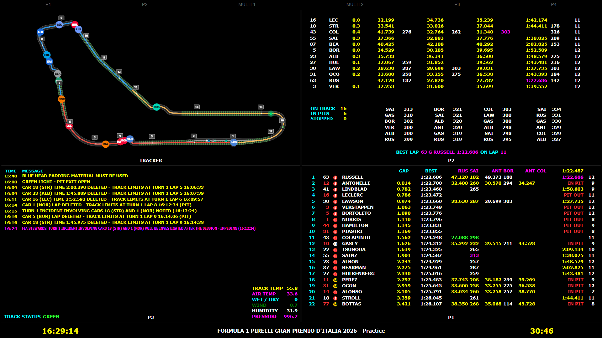
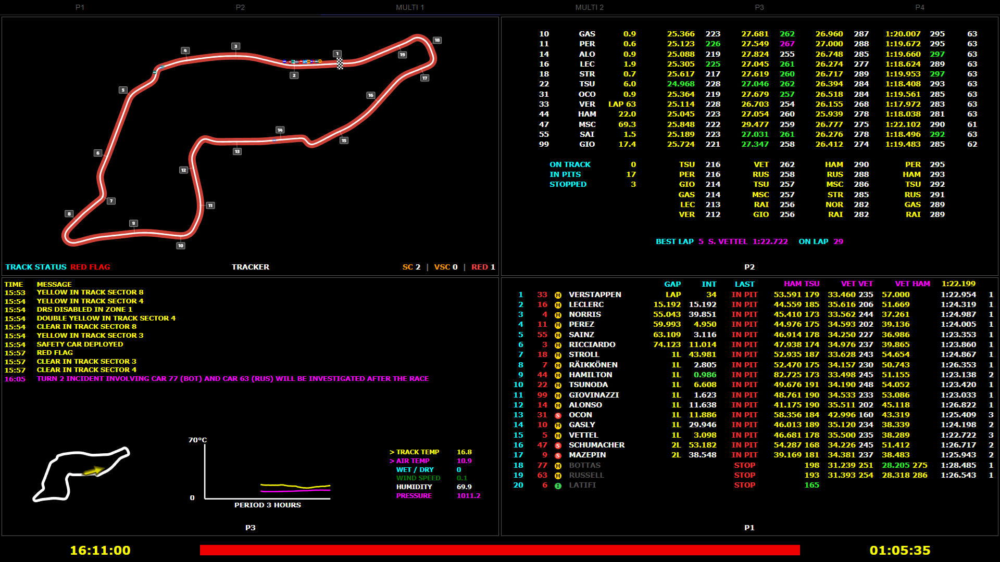
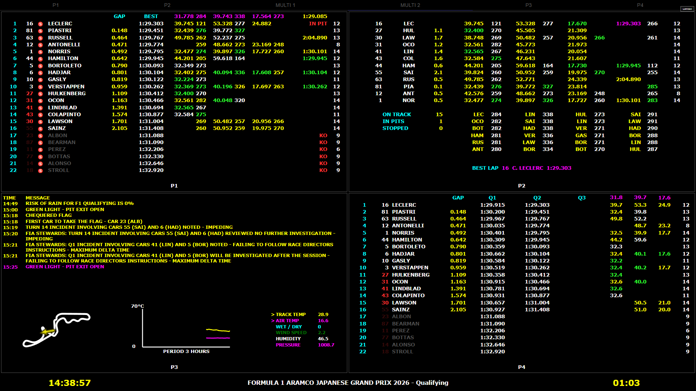
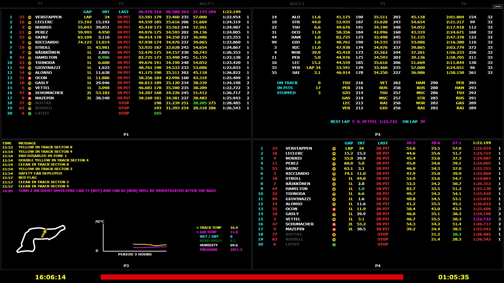
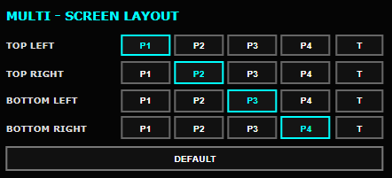
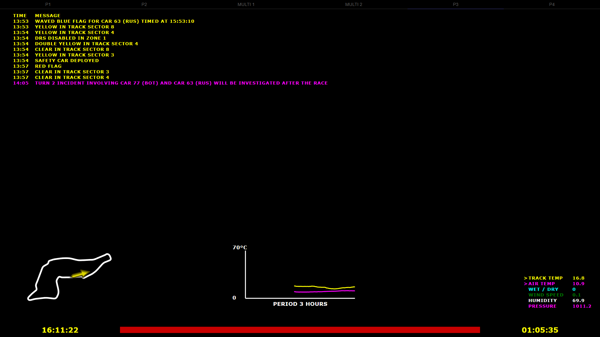

# Retro LiveTiming – MultiView Edition

Customized **Retro LiveTiming** build focused on the **MULTI 1 / MULTI 2**
timing layouts.

**Current release: v1.3.0**

This project is an unofficial community modification of Retro LiveTiming by
TrueVirusTV. The embedded upstream package metadata declares the original
project as MIT licensed.

> Not affiliated with or endorsed by Formula 1, F1 TV, MultiViewer, or their
> respective owners.

## Highlights

### MULTI 1
- Refined fixed 2×2 MultiView layout.
- Compact P1, P2, P3 and P4 presentation.
- Numerous alignment, spacing and readability improvements.
- Lower P3 weather / track-map section integrated into the layout.

### MULTI 2
- Refined 2×2 MultiView layout.
- P1, P2, P3 and P4 can be freely assigned to any of the four windows.
- Built-in **LAYOUT** control for changing the arrangement while Retro LiveTiming is running.
- Selecting a view automatically swaps the affected windows.
- **STANDARD** restores the default arrangement.
- Multi 2 layout customization is independent from the fixed Multi 1 layout.

### P1
- Refined timing-column alignment.
- Improved BEST lap presentation.
- Simplified compact headers in Practice and Race.
- Unneeded headings such as POS, CAR, DRIVER and T are hidden in the Multi layouts.

### P2
- ON TRACK / IN PITS / STOPPED counters.
- Six-row speed ranking area.
- Refined BEST LAP / ON LAP presentation.
- Improved gap-to-car-ahead alignment.
- Refined lap-count positioning.
- Improved replay rewind handling.
- When seeking backwards in a replay, cached lap-dependent values are reset so data from later laps is no longer displayed at an earlier replay position.

### Race Control Tracker
- Tracks Safety Car, Virtual Safety Car and Red Flag phases.
- Displays cumulative **SC / VSC / RED** counters.
- Counter history remains visible after a Safety Car, VSC or Red Flag phase has ended.
- Improved compatibility with older F1 replay timing data.

### Qualifying
- Refined MultiView Qualifying presentation.
- Improved timing-column spacing and readability.
- Refined P4 Qualifying overview with GAP and Q1 / Q2 / Q3 session times.
- Improved driver-status and elimination presentation.

### P3
- Race-control messages are displayed chronologically.
- The newest message appears at the bottom.
- Integrated circuit map using MultiViewer circuit geometry.
- Custom wind-direction arrow aligned to the displayed circuit orientation.
- 3-hour track-temperature and air-temperature graph.
- Compact weather block with track temperature, air temperature, wet/dry status, wind speed, humidity and pressure.
- Refined lower-layout sizing, spacing and footer clearance.

### P4 – Practice
- Removed Speed 1 / Speed 2 / Speed 3 columns.
- Compact sector values with one decimal place.
- Rotating theoretical sector-best / driver-abbreviation headers.
- Theoretical best lap shown in magenta.
- GAP centered.
- Last-lap values aligned under the theoretical best-lap column.
- Simplified compact headers.

### P4 – Race
- Car number positioned cleanly between position and driver.
- Compact race header.
- Pit-count values remain visible while the P heading is hidden.

### Footer
- Countdown timing corrected.
- Track-status bar sizing and vertical positioning refined.

## Screenshots

> **Track map note:** Circuit geometry used by the integrated P3 map is sourced from **MultiViewer** data. This project is not affiliated with or endorsed by MultiViewer.

### Multi 1 – Practice

### Multi 1 – Race

### Multi 2 – Qualifying

### Multi 2 – Race

### Multi 2 – Custom Layout

The four views can be freely assigned to the four Multi 2 windows using the
built-in **LAYOUT** control.

### P3 – Race

Race Control, circuit map, weather information and temperature history.

## Installation

### v1.3.0 ASAR update

1. Download `RetroLiveTiming-MultiView-v1.3.0-ASAR.zip`.
2. Close Retro LiveTiming.
3. Extract `app.asar` from the ZIP.
4. Back up the existing `resources/app.asar` file.
5. Replace it with the new `app.asar`.
6. Start Retro LiveTiming again.

### v1.0.0 portable Windows package

The original complete portable Windows package is still available from the v1.0.0 release.

## Requirements

- Windows 10 or Windows 11.
- MultiViewer / live timing must be running and accessible to Retro LiveTiming.

## Versioning

The public MultiView Edition started at **v1.0.0**.

The executable itself may still show metadata from the original upstream
application because this release replaces `resources/app.asar` rather than
rebuilding the complete Windows `.exe`.

## Attribution / License

Original application author in the embedded package metadata: **TrueVirusTV**.

The upstream package metadata declares the license as **MIT**. Preserve the
original copyright and license notices when redistributing source or derivative
builds.

## Disclaimer

Formula 1, F1, F1 TV and related marks are trademarks of their respective
owners. This is an unofficial fan/community project.
